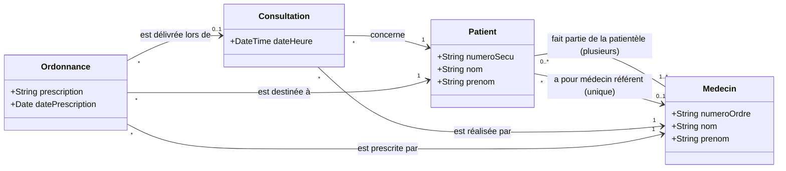
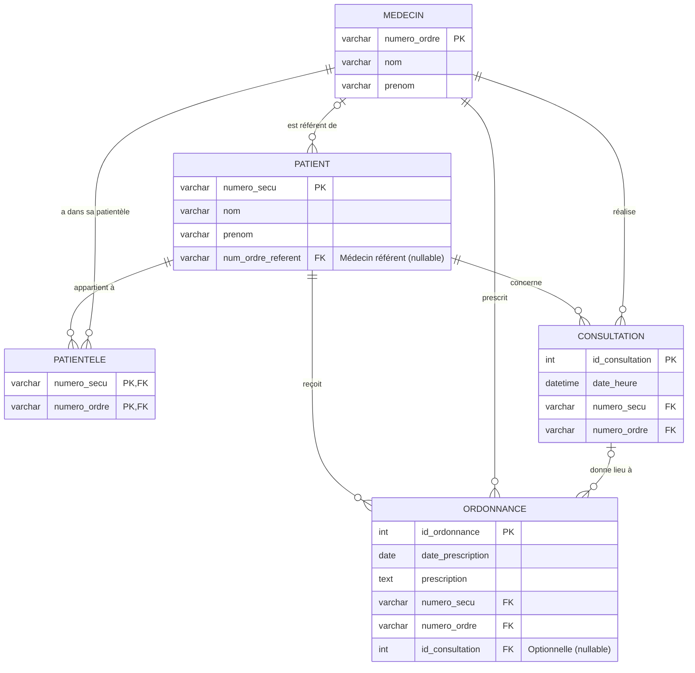
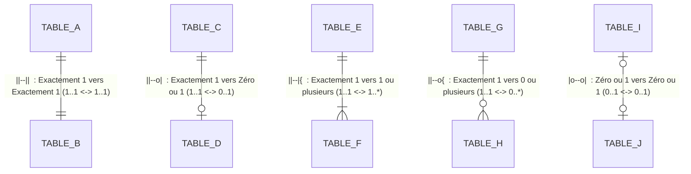

# Conception BDD : Cabinet médical

On modélise en UML puis diagramme de BDD la BDD d'un cabinet médical.

### Cahier des charges :
- des médecins (N°Ordre (PK), nom, prénom)
- des patients (N° sécu (PK), nom, prénom)
- des consultations (un patient, un médecin, une date et une heure)
- une ordonnance (un patient, un médecin, la prescription et facultativement la consultation pendant laquelle elle a été faite)
- un patient peut avoir un médecin unique "référent" (pas obligatoire)
- un patient fait partie de la patientèle de médecins (plusieurs)

---

### Partie 1 : Schéma de classes UML

#### Explications des choix de modélisation :
- **Patientèle (`Patient 0..* -- 1..* Medecin`)** : Un patient peut faire partie de la patientèle de **plusieurs médecins** au sein du cabinet (relation plusieurs-à-plusieurs $N \leftrightarrow N$). Inversement, un médecin a plusieurs patients dans sa patientèle. En base de données, cette multiplicité impose la création de la table de jointure `PATIENTELE`.
- **Médecin référent (`Patient * --> 0..1 Medecin`)** : À bien distinguer de la patientèle ! Alors qu'un patient peut consulter et appartenir à la patientèle de plusieurs médecins, il ne peut déclarer qu'**un seul médecin référent** (ou aucun, `0..1`). Cela se traduit par une simple clé étrangère nullable `num_ordre_referent` dans la table `PATIENT`.
- **Consultation (`* -> 1 Medecin`, `* -> 1 Patient`)** : Une consultation réunit obligatoirement et exactement un médecin et un patient à une date et heure données.
- **Ordonnance (`* -> 1 Medecin`, `* -> 1 Patient`, `* -> 0..1 Consultation`)** : Une ordonnance est toujours délivrée par un médecin à un patient. Le rattachement à une consultation physique est facultatif (`0..1`), ce qui permet de gérer les renouvellements sans consultation.

---

### Partie 2 : Schéma de base de données relationnelle (ERD / MLD)

#### Schéma relationnel (Mermaid ERD)

##### Légende de la notation Mermaid ERD ("Patte d'oie" / Crow's Foot)

En Mermaid, les relations s'écrivent : `<EntitéA> <SymboleGauche><TypeLien><SymboleDroit> <EntitéB> : "label"`.

###### Diagramme visuel des notations Mermaid :

###### Tableau de correspondance des symboles Mermaid :

| Symbole gauche | Symbole droit | Rendu visuel | Cardinalité (UML / Merise) | Signification |
| :---: | :---: | :--- | :---: | :--- |
| `\|\|` | `\|\|` | Deux barres parallèles | **1..1** (1,1) | **Exactement un** (obligatoire) |
| `\|o` | `o\|` | Cercle + barre | **0..1** (0,1) | **Zéro ou un** (optionnel) |
| `}\|` | `\|{` | Patte d'oie + barre | **1..\*** (1,n) | **Un à plusieurs** (au moins un) |
| `}o` | `o{` | Patte d'oie + cercle | **0..\*** (0,n) | **Zéro à plusieurs** (quelconque) |

> **Type de trait :**
> - `--` (trait plein) : relation identifiante
> - `..` (trait pointillé) : relation non identifiante

###### Exemples appliqués à ce schéma :
- `MEDECIN |o--o{ PATIENT` :
  - `|o` côté `MEDECIN` : un patient a **0 ou 1** médecin référent.
  - `o{` côté `PATIENT` : un médecin peut être référent de **0 à plusieurs** patients.
- `PATIENT ||--o{ CONSULTATION` :
  - `||` côté `PATIENT` : une consultation concerne **exactement 1** patient.
  - `o{` côté `CONSULTATION` : un patient peut avoir **0 à plusieurs** consultations.
- `MEDECIN ||--o{ CONSULTATION` :
  - `||` côté `MEDECIN` : une consultation est effectuée par **exactement 1** médecin.
  - `o{` côté `CONSULTATION` : un médecin peut effectuer **0 à plusieurs** consultations.
- `CONSULTATION |o--o{ ORDONNANCE` :
  - `|o` côté `CONSULTATION` : une ordonnance peut être rattachée à **0 ou 1** consultation (facultatif).
  - `o{` côté `ORDONNANCE` : une consultation peut générer **0 à plusieurs** ordonnances.
- `PATIENTELE` (table de jointure) :
  - `PATIENT ||--o{ PATIENTELE` et `MEDECIN ||--o{ PATIENTELE` modélisent l'association plusieurs-à-plusieurs : **un même patient peut ainsi appartenir à la patientèle de plusieurs médecins différents**, et un médecin suit plusieurs patients (clé composite `(#numero_secu, #numero_ordre)`).

#### Modèle Logique de Données (MLD textuel)

- **MEDECIN** (<u>numero_ordre</u>, nom, prenom)
- **PATIENT** (<u>numero_secu</u>, nom, prenom, #num_ordre_referent)
  - `#num_ordre_referent` : Clé étrangère référençant `MEDECIN(numero_ordre)` (`NULL`, médecin traitant non obligatoire)
- **PATIENTELE** (<u>#numero_secu, #numero_ordre</u>)
  - Clé primaire composite
  - `#numero_secu` : Clé étrangère référençant `PATIENT(numero_secu)`
  - `#numero_ordre` : Clé étrangère référençant `MEDECIN(numero_ordre)`
- **CONSULTATION** (<u>id_consultation</u>, date_heure, #numero_secu, #numero_ordre)
  - `#numero_secu` : Clé étrangère référençant `PATIENT(numero_secu)` (`NOT NULL`)
  - `#numero_ordre` : Clé étrangère référençant `MEDECIN(numero_ordre)` (`NOT NULL`)
- **ORDONNANCE** (<u>id_ordonnance</u>, date_prescription, prescription, #numero_secu, #numero_ordre, #id_consultation)
  - `#numero_secu` : Clé étrangère référençant `PATIENT(numero_secu)` (`NOT NULL`)
  - `#numero_ordre` : Clé étrangère référençant `MEDECIN(numero_ordre)` (`NOT NULL`)
  - `#id_consultation` : Clé étrangère référençant `CONSULTATION(id_consultation)` (`NULL`, consultation facultative)

---

### Règles de passage UML $\rightarrow$ Schéma relationnel appliquées :
1. **Patientèle (relation N-à-N)** : Création de la table de jointure `PATIENTELE` avec clé primaire composite `(#numero_secu, #numero_ordre)`.
2. **Médecin référent (relation 1-à-1 / 0..1)** : Migration de la clé primaire `numero_ordre` dans la table `PATIENT` en tant que clé étrangère nullable `#num_ordre_referent`.
3. **Consultations et Ordonnances (relations 1-à-N)** : Migration des identifiants `numero_secu` et `numero_ordre` en clés étrangères dans `CONSULTATION` et `ORDONNANCE`.
4. **Lien Consultation $\rightarrow$ Ordonnance (relation 0..1 à 0..N)** : Clé étrangère nullable `#id_consultation` dans `ORDONNANCE` pour refléter le caractère facultatif de la consultation.
