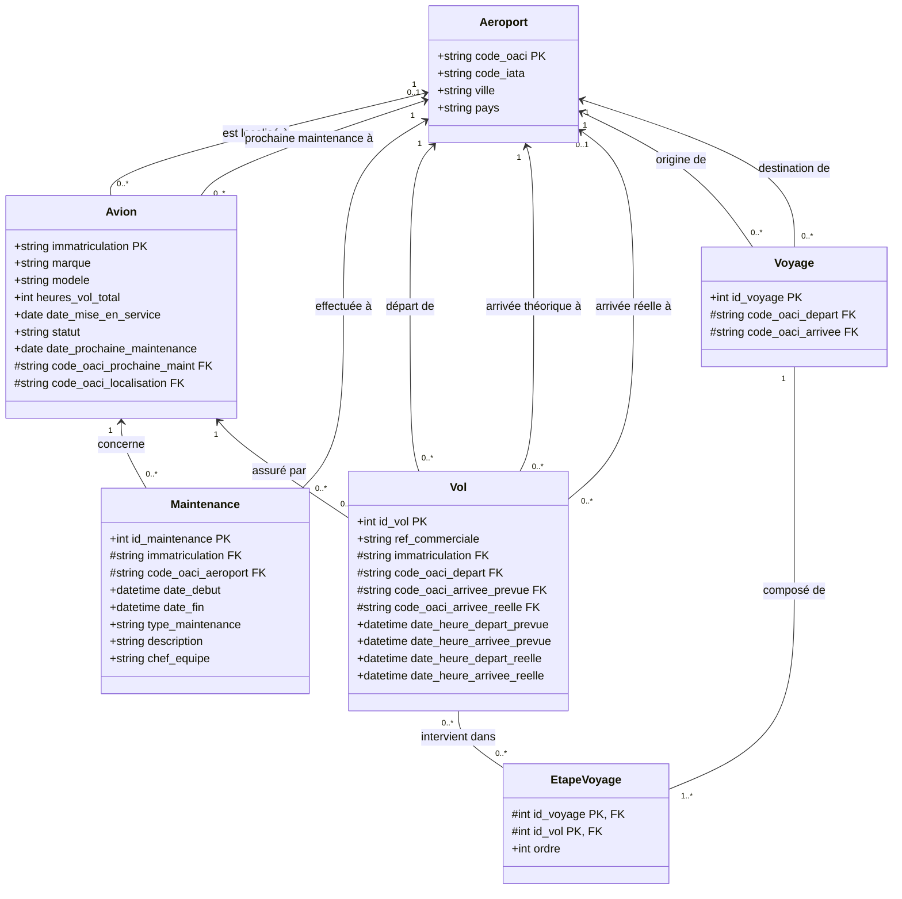
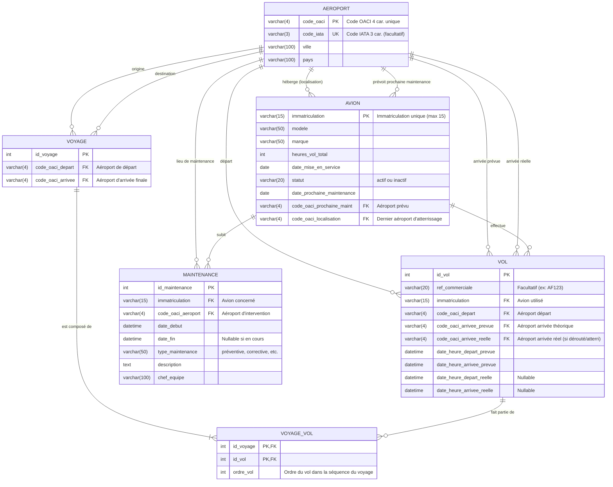

Vous devez modéliser la BDD d'une compagnie aérienne.
L'idée est de garder l'historique des vols réels effectués par les avions de la compagnie, ainsi que les informations sur les avions et leur maintenance.

# Avions

Pour un avion on a :
- son immatriculation : chaîne de caractères unique à 15 caractères (max)
- son modèle : chaîne de caractères (max 50 caractères)
- sa marque : chaîne de caractères (max 50 caractères)
- Son nombre d'heures de vol total : entier positif
- Sa date de mise en service : date
- Son statut : actif ou inactif
- Sa date et aéroport de prochaine maintenance prévue
- Son historique de maintenance (plusieurs enregistrements par avion, voir plus bas)
- sa localisation actuelle (le dernier aéroport où il a atterri)
	(on pourrait regarder le dernier vol effectué, mais pour simplifier l'interrogation on stocke directement l'aéroport)
# Aéroports
Pour un aéroport on a :
- son code IATA : chaîne de caractères unique de 3 caractères (facultatif)
- son code ICAO (OACI) : chaîne de caractères unique de 4 caractères unique
- Ville
- Pays
# Vols
Pour un vol on a :
- une référence de vol commercial (facultatif)
- un aéroport de départ
- un aéroport d'arrivée théorique
- la date et heure de départ prévue
- la date et heure d'arrivée prévue
- la date et heure de départ réelle
- la date et heure d'arrivée réelle
- l'aéroport d'arrivée réel
- l'avion utilisé pour le vol

# Maintenance
Pour une opération de maintenance on a :
- l'avion concerné
- la date de début de la maintenance
- la date de fin de la maintenance
- le type de maintenance (préventive, corrective, etc.)
- la description des travaux effectués
- le nom du chef d'équipe de maintenance responsable
- l'aéroport où la maintenance a été effectuée

# Voyages
Un voyage est une séquence de vols effectués par un passager.
Pour un voyage on a :
- un identifiant unique de voyage
- un aéroport de départ
- un aéroport d'arrivée
- les vols composant le voyage (1 ou plusieurs vols par voyage)

> ! un vol peut ne pas faire partie d'un voyage (vol de transit, vol cargo, etc.). Et un vol peut être associé à plusieurs voyages (Par exemple un vol Paris-Hong-Kong fait partie de d'un voyage Paris-Hong-Kong et aussi d'un voyage Paris-Sydney qui fait escale à Hong-Kong).

# UML

# MLD

**Représentation textuelle du MLD :**
- **AEROPORT** (<u>code_oaci</u>, code_iata, ville, pays)
- **AVION** (<u>immatriculation</u>, marque, modele, heures_vol_total, date_mise_en_service, statut, date_prochaine_maintenance, #code_oaci_prochaine_maint, #code_oaci_localisation)
- **MAINTENANCE** (<u>id_maintenance</u>, date_debut, date_fin, type_maintenance, description, chef_equipe, #immatriculation, #code_oaci_aeroport)
- **VOL** (<u>id_vol</u>, ref_commerciale, date_heure_depart_prevue, date_heure_arrivee_prevue, date_heure_depart_reelle, date_heure_arrivee_reelle, #immatriculation, #code_oaci_depart, #code_oaci_arrivee_prevue, #code_oaci_arrivee_reelle)
- **VOYAGE** (<u>id_voyage</u>, #code_oaci_depart, #code_oaci_arrivee)
- **VOYAGE_VOL** (<u>#id_voyage</u>, <u>#id_vol</u>, ordre_vol)

