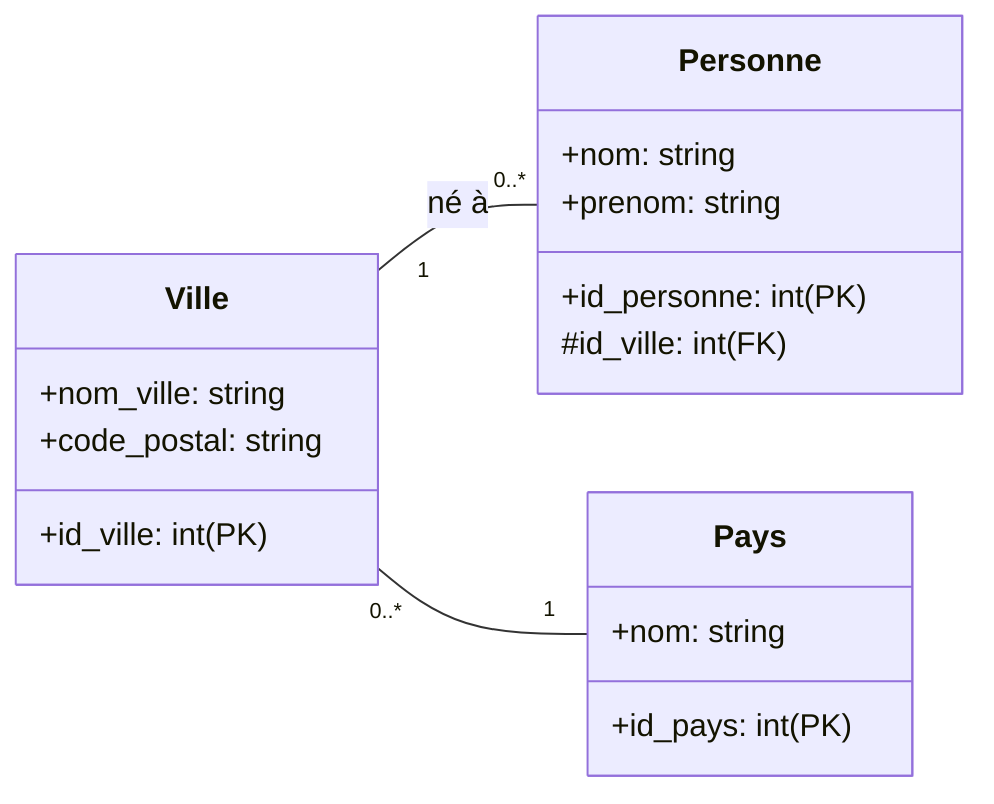
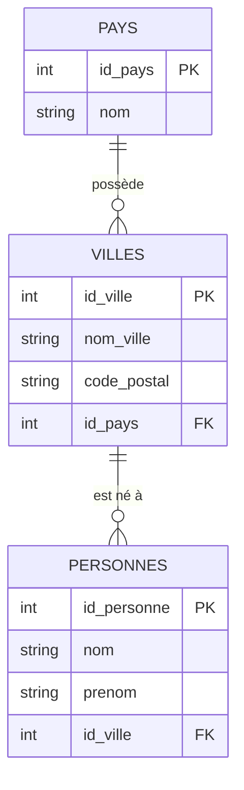

# Révision SQL
[[Révision SQL]]

# Merise
## Historique
Merise est une méthode de conception et de gestion de bases de données développée en France dans les années 1970. Elle a été créée pour répondre aux besoins croissants de gestion des informations dans les entreprises, en particulier avec l'avènement des systèmes informatiques.

Merise sert à beaucoup de choses :
- **Modélisation des données** : Merise permet de représenter graphiquement les données et leurs relations, facilitant ainsi la compréhension et la communication entre les parties prenantes.
- **Conception de bases de données** : La méthode aide à structurer les bases de données de manière efficace, en tenant compte des besoins fonctionnels et des contraintes techniques.
- **Gestion de projets informatiques** : Merise fournit un cadre méthodologique pour la planification, le suivi et la gestion des projets liés aux systèmes d'information.
- **Analyse des besoins** : Elle facilite l'analyse des besoins des utilisateurs et la traduction de ces besoins en spécifications techniques.
- **Documentation** : Merise encourage une documentation rigoureuse des systèmes d'information, ce qui est essentiel pour la maintenance et l'évolution des systèmes.

Merise est particulièrement populaire en France et dans les pays francophones, bien qu'elle soit moins connue à l'international par rapport à d'autres méthodes comme UML (Unified Modeling Language). Merise est moins adaptée aux approches agiles et aux environnements de développement rapide, mais elle reste une méthode solide pour la conception de systèmes d'information complexes.

# UML

## Historique
UML (Unified Modeling Language) est un langage de modélisation graphique utilisé pour la conception et la documentation des systèmes logiciels. Il a été développé dans les années 1990 par Grady Booch, Ivar Jacobson et James Rumbaugh, qui ont combiné leurs méthodes respectives pour créer un langage unifié.
UML sert à beaucoup de choses :
- **Modélisation des systèmes** : UML permet de représenter visuellement les différents aspects d'un système, facilitant ainsi la compréhension et la communication entre les parties prenantes.
- **Conception orientée objet** : UML est particulièrement adapté à la conception de systèmes orientés objet, en fournissant des diagrammes pour représenter les classes, les objets, les interactions, etc.
- **Documentation** : UML aide à documenter les systèmes logiciels de manière claire et structurée, ce qui est essentiel pour la maintenance et l'évolution des systèmes.
- **Analyse des besoins** : UML facilite l'analyse des besoins des utilisateurs et la traduction de ces besoins en spécifications techniques.
- **Gestion de projets** : UML peut être utilisé pour planifier et suivre les différentes phases d'un projet de développement logiciel.
- **Communication** : UML fournit un langage commun pour les développeurs, les analystes, les architectes et les autres parties prenantes, facilitant ainsi la collaboration.
- **Standardisation** : UML est un standard reconnu internationalement, ce qui en fait un choix populaire pour la modélisation des systèmes logiciels.
- **Flexibilité** : UML est un langage flexible qui peut être adapté à différents types de projets et de méthodologies de développement.
- **Intégration avec d'autres outils** : UML peut être intégré avec divers outils de développement logiciel, facilitant ainsi le processus de conception et de développement.
- **Support pour les méthodologies agiles** : UML peut être utilisé dans des environnements de développement agile, permettant une modélisation rapide et itérative.
- **Visualisation des processus métier** : UML peut également être utilisé pour modéliser les processus métier, aidant ainsi à aligner les systèmes informatiques avec les objectifs organisationnels.
- **Évolution continue** : UML est régulièrement mis à jour pour refléter les meilleures pratiques et les nouvelles tendances dans le développement logiciel.
## Modélisation des données : MCD et MLD

Merise utilise plusieurs types de diagrammes. Nous nous concentrerons sur le diagramme de classes (aussi appelé **MCD** - Modèle Conceptuel de Données) pour la modélisation des données.

Ce MCD nous permettra d'élaborer le schéma relationnel de la base de données (**MLD** - Modèle Logique de Données).

### MCD (Modèle Conceptuel de Données)

Le MCD est un diagramme qui représente les entités, leurs attributs et les relations entre elles. Voici les principaux éléments du MCD :
- **Entités** : Représentent les objets ou concepts du domaine. Elles sont généralement représentées par des rectangles.
- **Attributs** : Caractéristiques des entités. Ils sont représentés par des ovales reliés aux entités.
- **Relations** : Représentent les associations entre les entités. Elles sont représentées par des losanges reliés aux entités.
- **Cardinalités** : Indiquent le nombre minimum et maximum d'occurrences d'une entité pouvant être associée à une occurrence d'une autre entité. Elles sont généralement notées près des lignes de relation.
- **Identifiants** : Attributs ou ensembles d'attributs qui permettent d'identifier de manière unique une occurrence d'une entité. Ils sont souvent soulignés.

### MLD (Modèle Logique de Données)

Le MLD est une représentation plus détaillée et technique de la base de données, basée sur le MCD. Il traduit les concepts du MCD en structures de données relationnelles. Voici les principaux éléments du MLD :
- **Tables** : Représentent les entités du MCD. Chaque table correspond à une entité et contient des colonnes pour chaque attribut.
- **Colonnes** : Représentent les attributs des entités. Chaque colonne a un type de données (par exemple, entier, chaîne de caractères, date, etc.).
- **Clés primaires** : Attributs ou ensembles d'attributs qui identifient de manière unique chaque enregistrement dans une table. Elles sont souvent soulignées.
- **Clés étrangères** : Attributs dans une table qui font référence à la clé primaire d'une autre table, établissant ainsi une relation entre les deux tables.
- **Relations** : Représentées par des lignes entre les tables, indiquant comment les tables sont liées entre elles. La relation entre les clés primaires et les clés étrangères définit les relations entre les tables dans le MLD.

### Exemple

Voici des exemples simples pour illustrer la création d'un MCD puis d'un MLD.
Ici les termes `PK` désignent les clés primaires (Primary Key) et les `FK` les clés étrangères (Foreign Key)
#### MCD en UML

#### MLD (diagramme de BDD ici avec en plus la notation "patte d'oie")

**Représentation textuelle du MLD :**
- **PAYS** (<u>id_pays</u>, nom)
- **VILLE** (<u>id_ville</u>, nom_ville, code_postal, #id_pays)
- **PERSONNE** (<u>id_personne</u>, nom, prenom, #id_ville)

##### Légende de la notation "Patte d'oie" (Crow's Foot)

> 💡 **Lecture dans notre exemple :**
> - `PAYS ||--o{ VILLE` :
>   - Côté `PAYS` (`||`) : Une ville est rattachée à **exactement 1** pays.
>   - Côté `VILLE` (`o{`) : Un pays peut regrouper **0 ou plusieurs** villes.
> - `VILLE ||--o{ PERSONNE` :
>   - Côté `VILLE` (`||`) : Une personne a **exactement 1** ville de naissance.
>   - Côté `PERSONNE` (`o{`) : Une ville peut être le lieu de naissance de **0 ou plusieurs** personnes.

