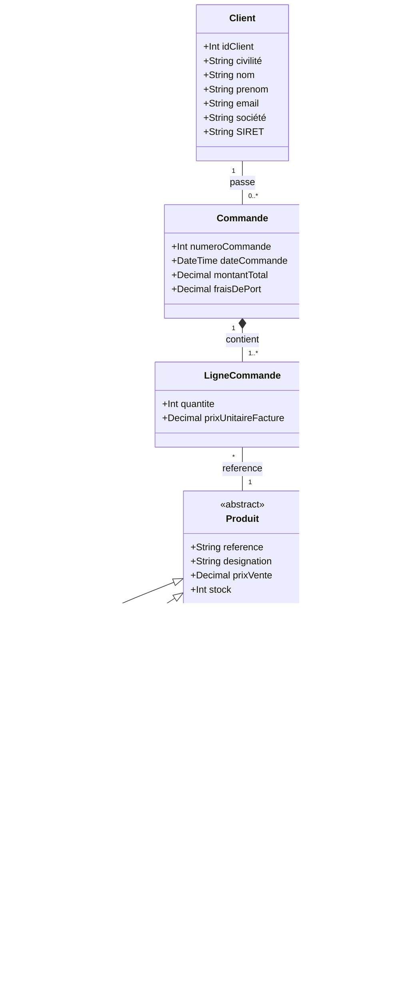
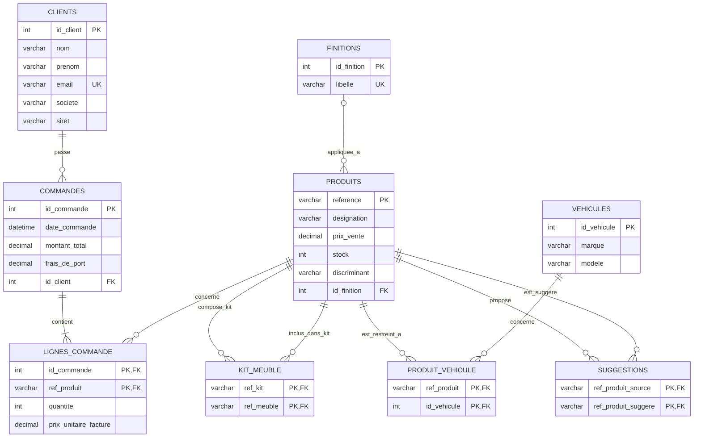

# Problème de l'héritage
# Exercice : Gestion de Produits, Kits et Compatibilité Véhicules (Héritage)

## 1. Énoncé & Règles de gestion

Une entreprise spécialisée dans l'aménagement de véhicules commercialise différents types de produits et gère les commandes de ses clients.

### Règles de gestion :
1. **Les Produits & l'Héritage :**
   - L'entreprise vend trois types de produits : des **Meubles**, des **Kits** et des **Équipements**.
   - Tous les produits partagent des caractéristiques communes : une référence unique (code article), une désignation, un prix de vente unitaire et une quantité en stock.
   - Les meubles possèdent des dimensions (hauteur, largeur, profondeur).
   - Les kits disposent d'un lien vers une notice de montage.
   - Les équipements possèdent une catégorie ou des caractéristiques techniques spécifiques.
2. **Composition des Kits :**
   - Un kit est composé de meubles (au minimum 2 meubles pour constituer un kit).
   - Un même meuble peut entrer dans la composition de plusieurs kits différents, éventuellement en plusieurs exemplaires (ex: 1 table et 4 chaises).
3. **Finitions :**
   - Les **meubles** et les **kits** peuvent être proposés en 3 finitions prédéfinies : *vernis*, *brut* ou *gris*.
   - Les équipements n'ont pas de notion de finition.
4. **Compatibilité Véhicules :**
   - Chaque véhicule est caractérisé par une marque et un modèle (et éventuellement une année ou génération).
   - **Certains produits** sont compatibles uniquement avec une liste précise de véhicules.
   - **Les autres produits** sont dits "universels" et compatibles avec tous les véhicules.
5. **Suggestions de produits :**
   - Sur la boutique, un produit peut faire l'objet de suggestions de produits complémentaires (association réflexive : un produit peut recommander d'autres produits).
6. **Commandes Clients :**
   - On enregistre les clients (nom, prénom, adresse email unique).
   - Un client passe des commandes (numéro de commande, date, montant global).
   - Une commande est composée d'une ou plusieurs lignes de commande.
   - Chaque ligne de commande référence un produit, une quantité commandée et le prix unitaire facturé (historisé au moment de l'achat).

---

## 2. Schéma de Classes UML

### Explications des choix de modélisation UML :
- **Classe mère abstraite `Produit` :** Permet de mutualiser la référence, la désignation, le prix catalogue et le stock. Elle permet également aux lignes de commande, aux suggestions et aux compatibilités véhicules de pointer de manière uniforme vers n'importe quel produit (`Meuble`, `Kit` ou `Equipement`).
- **Association `Kit` $\leftrightarrow$ `Meuble` avec classe d'association `CompositionKit` :** La cardinalité `2..*` côté Meuble garantit qu'un kit regroupe au moins deux éléments. L'attribut `quantite` dans `CompositionKit` est indispensable si un kit contient $N$ fois la même référence de meuble.
- **Entité `Finition` :** Reliée uniquement à `Meuble` et `Kit`. Les 3 valeurs (*vernis*, *brut*, *gris*) constituent les instances de cette classe.
- **Compatibilité Véhicule :** Relation plusieurs-à-plusieurs (`*` - `*`).
- **Ligne de commande & Historisation du prix :** L'attribut `prixUnitaireFacture` dans `LigneCommande` évite que la modification ultérieure du prix dans `Produit` ne vienne fausser la facture passée.

## 3. Schéma Relationnel (Mermaid ERD) - Stratégie TPH (Table Per Hierarchy)

Dans l'approche **TPH (Table Per Hierarchy / Single Table)**, l'ensemble de la hiérarchie d'héritage (`Produit`, `Meuble`, `Kit`, `Equipement`) est fusionné dans **une seule et unique table** `PRODUITS`.
- Une colonne discriminante (`discriminant`) permet d'identifier la spécialisation concrète de chaque enregistrement (`'MEUBLE'`, `'KIT'` ou `'EQUIPEMENT'`).
- Les attributs et associations spécifiques (comme `id_finition` pour les meubles et kits) deviennent des colonnes acceptant la valeur `NULL` (quand le produit est un équipement).
- L'association `Kit` - `Meuble` (`KIT_MEUBLE`) fait référence deux fois à la table `PRODUITS`.

---

## 4. Modèle Logique de Données (MLD textuel) - TPH

- **CLIENT** (<u>id_client</u>, nom, prenom, email, societe, siret)
  - `email` : contrainte `UNIQUE`
  - `societe`, `siret` : optionnels (si client professionnel)
- **COMMANDE** (<u>id_commande</u>, date_commande, montant_total, frais_de_port, #id_client)
  - `#id_client` : clé étrangère référençant `CLIENT(id_client)` (`NOT NULL`)
- **LIGNE_COMMANDE** (<u>#id_commande, #ref_produit</u>, quantite, prix_unitaire_facture)
  - `#id_commande` : clé étrangère référençant `COMMANDE(id_commande)`
  - `#ref_produit` : clé étrangère référençant `PRODUIT(reference)`
- **PRODUIT** (<u>reference</u>, designation, prix_vente, stock, **type_produit**, #id_finition)
  - `type_produit` : colonne discriminante (`CHECK discriminant IN ('MEUBLE', 'KIT', 'EQUIPEMENT')`)
  - `#id_finition` : clé étrangère référençant `FINITION(id_finition)` (`NULL` si `discriminant = 'EQUIPEMENT'`)
- **FINITION** (<u>id_finition</u>, libelle)
  - `libelle` : contrainte `UNIQUE` ('Vernis', 'Brut', 'Gris')
- **KIT_MEUBLE** (<u>#ref_kit, #ref_meuble</u>, quantite)
  - `#ref_kit` : clé étrangère référençant `PRODUIT(reference)` (cible un produit de type 'KIT')
  - `#ref_meuble` : clé étrangère référençant `PRODUIT(reference)` (cible un produit de type 'MEUBLE')
  - `quantite` : nombre d'exemplaires du meuble dans ce kit
- **VEHICULE** (<u>id_vehicule</u>, marque, modele)
- **PRODUIT_VEHICULE** (<u>#ref_produit, #id_vehicule</u>)
  - `#ref_produit` : clé étrangère référençant `PRODUIT(reference)`
  - `#id_vehicule` : clé étrangère référençant `VEHICULE(id_vehicule)`
- **SUGGESTION** (<u>#ref_produit_source, #ref_produit_suggere</u>)
  - `#ref_produit_source` : clé étrangère référençant `PRODUIT(reference)`
  - `#ref_produit_suggere` : clé étrangère référençant `PRODUIT(reference)`

---
